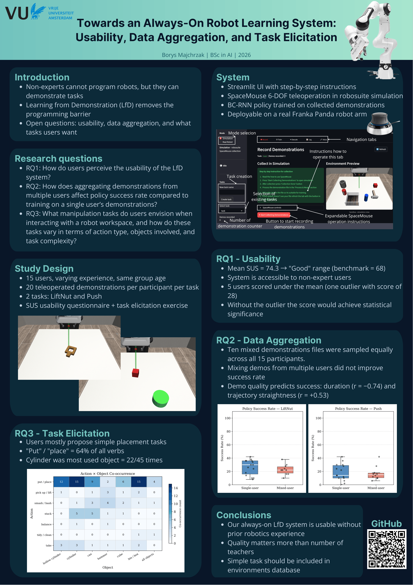

# Towards an Always-On Robot Teaching System: Usability, Data Aggregation, and Task Elicitation

Bachelor thesis project - Vrije Universiteit Amsterdam, 2026.

An always-on robot teaching system that lets non-expert users demonstrate tasks via teleoperation and trains a BC-RNN policy without writing any code. Built on [robosuite](https://robosuite.ai) + [robomimic](https://robomimic.github.io), deployable in simulation and on a real Franka Panda robot arm.

---

## What it does

- **Record** - collect demonstrations in a robosuite simulation environment using a SpaceMouse
- **Train** - train a BC-RNN policy on the collected demonstrations via robomimic
- **Execute** - run the trained policy and evaluate success rate
- **Voice** - optional voice interface (Whisper STT + pyttsx3 TTS)

All steps are accessible through a Streamlit UI with step-by-step instructions.

---

## Running the UI

```bash
streamlit run ui.py
```

---

## Project structure

```
ui.py # Main Streamlit interface
src/
  simulation/
    lift_nut_env.py # LiftNut task environment
    push_env.py # Push task environment
    sandbox_env.py # Environment used for task elicitation
    collect_human_demonstrations.py # Added a demo counter to an existing script
    run_trained_agent.py # Added an ability to gather save data from each rollout
  robot_control/
    demo_recorder.py # Kinesthetic demo recording on a real robot
    collect_demos.py # Helper file for demo_recorder 
  learning/
    execute_policy.py # Policy rollout script
  voice/
    voice_handler.py # Whisper STT + intent detection + TTS
assets/ # Environment preview images
figures/ # Generated thesis figures
merge_demos.py # Merge multiple HDF5 demo files
sample_mixed_dataset.py # Sample mixed-user datasets for RQ2
```

---

## Robosuite integration

The files in `src/simulation/` are modified or new files for the robosuite package and must be copied into local robosuite installation before running the UI.

**Custom environments** — copy all envs to:
/robosuite/robosuite/environments/manipulation/

**Modified scripts** — update `collect_human_demonstrations.py` and `run_trained_agent.py` in:
/robosuite/robosuite/scripts/

---

## User study data

Raw demonstration data from the 15-participant user study is stored in `user_study_data/` (one folder per user, HDF5 format). The anonymised SUS and task elicitation responses are in `user_study_data/User_study_form_data.csv`.

---

## Research questions

| | Question | Key result |
|---|---|---|
| RQ1 | How do users perceive the usability of the LfD system? | Mean SUS = 74.3 ("Good") |
| RQ2 | How does aggregating demonstrations from multiple users affect policy success rate compared to training on a single user’s demonstrations? | No significant improvement — demo quality predicts success more than number of teachers |
| RQ3 | What manipulation tasks do users envision when in-teracting with a robot workspace, and how do these tasks vary in terms of action type, objects involved, and task complexity? | 64 % put/place verbs — users prefer simple placement tasks |

---

## Poster

